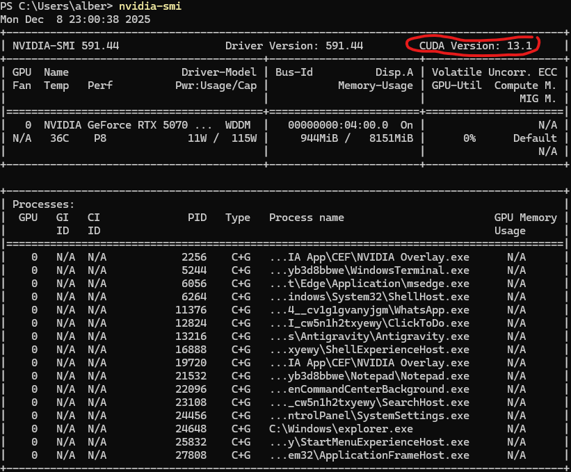
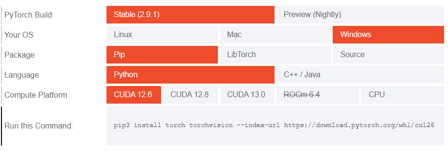

# NLP II: Clasificación de Géneros Cinematográficos

En la practica, exploramos la evolución de las técnicas de PLN, comparando el rendimiento de **modelos clásicos de Machine Learning**  frente a **arquitecturas basadas en Transformers**, e incluye un módulo de **explicabilidad** para interpretar las decisiones tomadas por los modelos.

---

## Características Principales

* **Pipeline Completo**: Desde la descarga y armonización de datos hasta la evaluación final.
* **Modelos Clásicos**: Implementación de Naive Bayes, Regresión Logística, SVM y Random Forest como líneas base (baselines).
* **Deep Learning**: Fine-tuning de modelos preentrenados (`deberta-v3-large`, `roberta-base`).
* **Explicabilidad (XAI)**:
  * **LIME** para visualizar la contribución de palabras en modelos clasicos.
  * **Integrated Gradients** (vía Captum) para analizar la atribución de tokens en Transformers.
* **Armonización de Etiquetas**: Agrupación inteligente de géneros (ej. *Action*, *Adventure*, *War* -> `action_adventure`).

---

## Configuración del Entorno

Sigue estos pasos para configurar el entorno

### 1. Preparación

```powershell
pip install pandas
```

 del Entorno Virtual

Abrir una nueva terminal, dirigirse a la base del proyecto y ejecutar el siguiente comando:

```bash
# Windows
python -m venv .venv
.\.venv\Scripts\activate
```

### 2. Instalación de Dependencias Generales

Instala las librerías base necesarias para el proyecto:

```bash
pip install -r requirements.txt
```

### 3. Instalación de PyTorch

Para aprovechar la GPU, es muy importante instalar la versión correcta de PyTorch que sea compatible con tu tarjeta gráfica.

1. Verifica tu versión de drivers CUDA ejecutando:

   ```bash
   nvidia-smi
   ```

   (Fíjate en la versión mostrada en la esquina superior derecha, rodeada) Ejemplo de mi salida:

   

   > **Nota**: Deberías ver algo similar a `CUDA Version: 11.8` o `12.1`.
   >

   Abrir la pagina la web oficial de [PyTorch](https://pytorch.org/get-started/locally/). Tendrás que seleccionar tu SO, gestor de paquetes (Pip), lenguaje (Python) y versión de CUDA.

   
2. Ejecuta el comando generado en la página en tu terminal (con el entorno activado). Ejemplo:

   ```bash
   pip3 install torch torchvision torchaudio --index-url https://download.pytorch.org/whl/cu118
   ```

### 4. Configuración del Kernel de Jupyter

Para ejecutar los notebooks utilizando el entorno creado:

```bash
pip install ipykernel
python -m ipykernel install --user --name=.venv --display-name "NLP_Practica1_Env"
```

---

## Estructura del Proyecto

El proyecto está organizado para que sea muy sencillo de entender:

| Archivo / Directorio        | Descripción                                                                                         |
| :-------------------------- | :--------------------------------------------------------------------------------------------------- |
| `src/`                    | Código fuente Python (modelos, preprocesamiento, utilidades).                                       |
| `Models/`                 | Directorio donde se almacenan objetos de los modelos entrenados.                                    |
| `F_Models_Training.ipynb` | **Entrenamiento**: Descarga de datos, preprocesamiento y entrenamiento de modelos.             |
| `F_Data_Analisis.ipynb`   | **Análisis**: Exploración de datos y distribución de géneros (antes y después del mapeo). |
| `F_Models_Tests.ipynb`    | **Evaluación**: Carga de modelos guardados y generación de métricas comparativas.           |
| `F_Explicabilidad.ipynb`  | **Interpretación**: Análisis visual de las predicciones (LIME y Captum).                     |
| `main.py`                 | Script auxiliar para la descarga inicial de datasets.                                                |

---

## Guía de Uso

### 1. Descarga de Datos

El primer paso es asegurar que los datasets están disponibles localmente. Ejecuta el script principal:

```bash
python main.py
```

Esto descargará y preparará los datos de entrenamiento y test en la carpeta `datasets/`. (Los datos ya estarán armonizados cuando los bajas)

### 2. Análisis de Datos

Para ver los datos originales y cómo hemos harmonizado los datasets:

1. Abre y ejecuta `F_Data_Analisis.ipynb`. En este de hace un analisis de las clases y textos.

### 3. Entrenamiento y Evaluación

Los notebooks están diseñados para ejecutarse secuencialmente:

1. Abre `F_Models_Training.ipynb` para generar los modelos.
   * *Nota: El entrenamiento del Transformer puede tardar mucho tiempo.*
2. Abre `F_Models_Tests.ipynb` para evaluar los resultados y ver las tablas comparativas.

### 4. Explicabilidad

Para entender qué palabras o tokens fueron determinantes en la clasificación, ejecuta `F_Explicabilidad.ipynb`.

### IMPORTANTE

Es muy recomendable ir leyendo los encabezados y comentarios, porque estos explican las celdas. Sobre todo en el notebook `F_Explicabilidad.ipynb`
